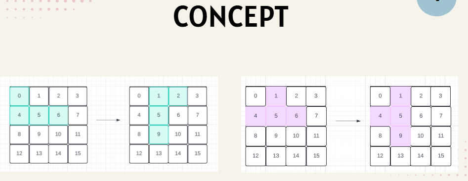

# Tetris with Python

## Description

This repository hosts a modern Tetris game implemented in Python using the Pygame library. Tetris is a classic tile-matching puzzle video game where players manipulate falling tetrominoes (geometric shapes composed of four square blocks) to create complete horizontal lines. When a line is completed, it disappears, and the player earns points. The game features a clean interface, dark/light mode, and additional gameplay options.

---

  
  

## Features

- **Classic Tetris Gameplay:** Control falling tetrominoes using arrow keys to move, rotate, or accelerate their descent.
- **Scoring System:** Earn points for completing lines, with bonus points for clearing multiple lines at once. The game tracks the high score for the session.
- **Additional Shapes:** Includes unique tiles such as U, plus sign, and stair (hill) shapes for extra challenge.
- **Dark Mode / Light Mode:** Switch between color schemes for comfortable play in any environment.
- **Hard Mode / Easy Mode:** Adjust the falling speed of the pieces for a more challenging or relaxed experience.
- **Game Over State:** The game ends when the stack of tetrominoes reaches the top of the playfield, displaying a game over screen and allowing replay.
- **Simple Graphics and UI:** Clean interface with score display, mode toggles, and responsive controls using Pygame's drawing functions.

## Repository Structure

- `game.py`: Main script that initializes the Pygame environment and implements the game loop and UI.
- `tetris.py`: Contains the `Tetris` class responsible for managing the game logic, including tetromino movement, collision detection, scoring, and game state.
- `shape.py`: Defines the `Shape` class representing individual tetrominoes, along with their shapes, colors, and rotation.

## Controls

- **Left/Right Arrow:** Move piece left/right
- **Up Arrow:** Rotate piece
- **Down Arrow:** Move piece down faster
- **Space:** Drop piece instantly
- **Mouse:** Click buttons for dark/light mode, hard/easy mode, and play again
- **Esc:** Quit game

  

## Authors
- [@darianicoleduduna](https://github.com/darianicoleduduna)
- [@Stefan2810](https://github.com/Stefan2810)

